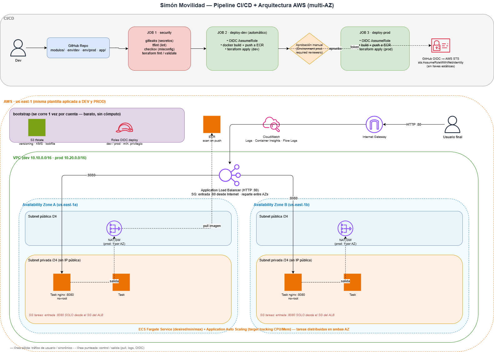

# Simón Movilidad — Despliegue en AWS ECS Fargate con GitHub Actions

Infraestructura como código (Terraform) y pipeline CI/CD (GitHub Actions) para
desplegar una app de prueba en **AWS ECS Fargate**, en `us-east-1`, con dos
ambientes (`dev` y `prod`), seguridad integrada y buenas prácticas de **Zero
Trust**.

## Qué incluye

- **Cómputo:** ECS Fargate (serverless) tras un **Application Load Balancer** HTTP.
- **Autoscaling:** Application Auto Scaling por CPU y memoria (target tracking).
- **Credenciales:** **GitHub OIDC** → roles IAM temporales. Sin llaves estáticas.
- **Estado remoto:** S3 con **lockfile nativo** (`use_lockfile`, sin DynamoDB),
  cifrado, versionado y bloqueo de acceso público.
- **Seguridad en el pipeline:** `gitleaks` (secretos), `tflint` (lint IaC),
  `checkov` (misconfiguraciones de Terraform y Dockerfile).
- **Zero Trust:** tareas en subnets privadas sin IP pública, security groups de
  mínimo privilegio encadenados (solo el ALB alcanza las tareas), contenedor
  no-root con filesystem de solo lectura, TLS obligatorio en S3/ECR, VPC Flow
  Logs.

## Arquitectura



El tráfico del usuario entra por el ALB (HTTP :80) en las subnets públicas y se
reparte entre **dos zonas de disponibilidad**. Las tareas de ECS Fargate corren
en subnets **privadas** (sin IP pública) de ambas AZs y solo aceptan tráfico
desde el ALB (:8080). La salida a internet (pull de ECR, logs) va por NAT
Gateway. El pipeline de GitHub Actions valida (seguridad), despliega dev
automáticamente y prod tras aprobación manual, usando OIDC para credenciales
temporales (sin llaves estáticas).

> El diagrama editable está en [`docs/arquitectura.drawio`](docs/arquitectura.drawio) (abrir con draw.io).

## Estructura del repositorio

```
.
├── app/                  # App de prueba (nginx + landing estática)
│   ├── Dockerfile        # Imagen endurecida (no-root, puerto 8080)
│   ├── nginx.conf        # Config con endpoint /health
│   └── html/index.html   # Landing minimalista
├── bootstrap/            # Crea los buckets S3 de estado (se corre 1 vez)
├── modulos/              # Módulos Terraform reutilizables
│   ├── networking/       # VPC, subnets, NAT, SGs
│   ├── iam/              # OIDC + roles ECS
│   ├── alb/              # Load balancer HTTP
│   ├── ecr/              # Repositorio de imágenes
│   └── ecs/              # Cluster, task, service, autoscaling
├── env/
│   ├── dev/              # Composición + backend dev
│   └── prod/             # Composición + backend prod
├── .github/workflows/
│   └── ci-cd.yml         # Pipeline
├── .tflint.hcl           # Config de TFLint
└── .gitleaks.toml        # Config de gitleaks
```

## Puesta en marcha

### Requisitos

- Cuenta de AWS y una identidad con permisos de administrador **solo para el
  bootstrap inicial**.
- Terraform >= 1.10, AWS CLI, Docker (para pruebas locales opcionales).
- Repositorio en GitHub.

### 1. Crear los buckets de estado (una sola vez)

```bash
cd bootstrap
terraform init
terraform apply
```

Anota el output `state_bucket_names`. Los nombres son
`simon-movilidad-tfstate-<env>-<account_id>`.

### 2. Ajustar los backends

En `env/dev/backend.tf` y `env/prod/backend.tf`, el nombre del bucket termina en
`ACCOUNT_ID`. En el pipeline esto se resuelve con `-backend-config` usando el
secret `AWS_ACCOUNT_ID`. Para correrlo **localmente**, reemplaza `ACCOUNT_ID`
por tu account id real o pasa:

```bash
terraform init -backend-config="bucket=simon-movilidad-tfstate-dev-<account_id>"
```

### 3. Configurar el repositorio

En `env/dev/terraform.tfvars` y `env/prod/terraform.tfvars`, cambia
`github_repository` por tu `<org>/<repo>` real.

### 4. Crear el rol OIDC (primer apply de dev)

El rol que GitHub Actions asume lo crea el propio Terraform. Para el primer
`apply` necesitas credenciales de AWS locales:

```bash
cd env/dev
terraform init -backend-config="bucket=simon-movilidad-tfstate-dev-<account_id>"
terraform apply -var="github_repository=<org>/<repo>"
```

Esto crea, entre otras cosas:
- El **OIDC provider** de GitHub (solo en dev; prod lo reutiliza).
- El rol `simon-movilidad-dev-gha-deploy`.

Repite en `env/prod` para crear `simon-movilidad-prod-gha-deploy` (reutiliza el
OIDC provider).

> Tras este arranque, el ciclo de vida normal lo maneja el pipeline vía OIDC. Ya
> no necesitas llaves estáticas.

### 5. Configurar GitHub

En **Settings → Secrets and variables → Actions**:

- Secret `AWS_ACCOUNT_ID` = tu account id de 12 dígitos.

En **Settings → Environments**, crea dos environments:

- `dev`
- `prod` → añade **Required reviewers** para la aprobación manual del deploy a
  producción.

### 6. Desplegar

- Abre un **Pull Request** → corre seguridad + `terraform plan` de dev.
- Haz **merge/push a `main`** → corre seguridad, despliega dev automáticamente,
  y queda a la espera de **aprobación manual** para prod.

Al final de cada deploy, el pipeline imprime la URL pública del ALB
(`alb_url`).

## Flujo del pipeline

| Evento              | security | plan dev | deploy dev | deploy prod            |
|---------------------|:--------:|:--------:|:----------:|:----------------------:|
| Pull Request        |    ✓     |    ✓     |     —      |          —             |
| Push a `main`       |    ✓     |    —     |     ✓      | ✓ (con aprobación)     |

El deploy de cada ambiente hace dos `apply`: el primero crea/actualiza la infra
(incluido ECR), el segundo actualiza el servicio ECS con la imagen recién
construida y subida (`<ecr_url>:<sha>`).

## Prácticas de seguridad / Zero Trust aplicadas

- **Sin credenciales de larga duración:** OIDC con sesiones de 1 hora.
- **Mínimo privilegio:** el rol del pipeline no es Admin; se limita a los
  servicios del proyecto y a roles IAM con prefijo del proyecto.
- **Red segmentada:** tareas sin IP pública en subnets privadas; el único
  camino de entrada es ALB → SG de tareas.
- **Contenedor endurecido:** usuario no-root, `readonlyRootFilesystem`, Alpine.
- **Datos cifrados:** estado S3 (SSE-KMS), imágenes ECR, logs; TLS obligatorio.
- **Trazabilidad:** VPC Flow Logs, Container Insights, ECR scan on push, tags
  inmutables en prod.
- **Despliegue seguro:** circuit breaker con rollback automático en ECS.

## Diferencias dev vs prod

| Aspecto              | dev            | prod                    |
|----------------------|----------------|-------------------------|
| NAT Gateway          | 1 (ahorro)     | 1 por AZ (HA)           |
| CPU / memoria tarea  | 256 / 512      | 512 / 1024              |
| Autoscaling          | 1–3 tareas     | 2–10 tareas             |
| Tags de imagen ECR   | MUTABLE        | IMMUTABLE               |
| Protección borrado ALB | no           | sí                      |
| Aprobación deploy    | automática     | manual (reviewers)      |
| VPC CIDR             | 10.10.0.0/16   | 10.20.0.0/16            |

## Notas

- La app usa **HTTP** porque no hay dominio/ACM. Para HTTPS, agrega un
  certificado ACM y un listener 443 con redirección 80→443 en `modulos/alb`.
- El contenedor escucha en **8080** (no 80) para poder correr como no-root; el
  ALB expone 80 al exterior y enruta a 8080.
